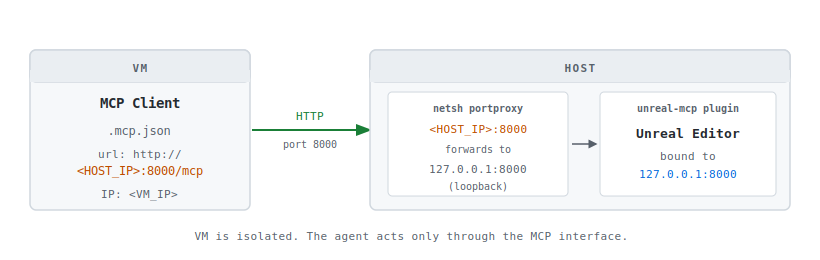

# unreal-mcp-vm-bridge

A reproducible setup for tunneling any MCP client (running in a VM) to the
unreal-mcp plugin (bound to localhost on the host) via a Windows port proxy.

> **Architecture note:** unreal-mcp binds to `127.0.0.1` on the host, making
> it unreachable from any external interface including the VM. A `netsh portproxy`
> rule forwards a LAN-visible host port back to that loopback address, with no plugin
> changes, no shared filesystem, and no custom proxy layer.

```
unreal-mcp-vm-bridge/
├── README.md
├── LICENSE
├── assets/
│   └── topology.svg
└── scripts/
    ├── umvb-setup.ps1   <- one-shot: detects IP, portproxy + firewall + verify
    ├── umvb-remove.ps1  <- removes portproxy and firewall rules
    ├── umvb-status.ps1  <- read-only check of active rules
    └── umvb-test.ps1    <- connectivity test from the VM
```

## Prerequisites

VMware Workstation with the VM network adapter set to **Bridged**, and the bridged adapter manually set to your physical Ethernet adapter (not Automatic). This ensures the VM gets a LAN IP on the same subnet as the host. Unreal Engine with the unreal-mcp plugin installed and active. Claude Code installed in the VM.

## Network topology



## Step 1. Get the host IP from the VM

```cmd
ipconfig
ping <HOST_IP>
```

## Step 2. Configure Claude Code (VM)

Create `.mcp.json` at your project root on the VM:

```json
{
  "mcpServers": {
    "unreal-mcp": {
      "type": "http",
      "url": "http://<HOST_IP>:8000/mcp"
    }
  }
}
```

## Step 3. Run setup on the host (run as Administrator)

`scripts/umvb-setup.ps1` detects your LAN IP, adds the portproxy rule, opens the firewall, and verifies. All in one shot:

```powershell
.\scripts\umvb-setup.ps1
```

The script asks for the allowed source(s) and scopes the firewall rule to them (`remoteip`). This is hybrid by design:

- **Single VM:** enter the VM IP (for example `192.168.1.50`). Tightest scope.
- **Multiple VMs:** enter a range (`192.168.1.10-192.168.1.50`), a subnet (`192.168.1.0/24`), or a comma-separated list.
- **Blank:** opens the port to the whole LAN. Not recommended, the unreal-mcp server has no authentication.

For a stable rule, give the VM(s) a static IP or a DHCP reservation. A scope that points at a moving address breaks the bridge when the lease changes.

Or manually (replace `<SCOPE>` with a single IP, a range, a subnet, or a list):

```cmd
netsh interface portproxy add v4tov4 listenaddress=<HOST_IP> listenport=8000 connectaddress=127.0.0.1 connectport=8000
netsh advfirewall firewall add rule name="unreal-mcp VM bridge" dir=in action=allow protocol=TCP localport=8000 remoteip=<SCOPE>
```

## Step 4. Verify

On the **host**, confirm both entries are listening:

```cmd
netstat -an | findstr 8000
```

Expected output:

```
TCP    127.0.0.1:8000    0.0.0.0:0    LISTENING   <- unreal-mcp plugin
TCP    <HOST_IP>:8000    0.0.0.0:0    LISTENING   <- portproxy
```

From the **VM**, run the test script:

```powershell
.\scripts\umvb-test.ps1
```

> **PowerShell:** `curl` is aliased to `Invoke-WebRequest`. Use `curl.exe` to invoke the real binary.

A `405 Method Not Allowed` response is a success indicator. It means the server is reachable and running. MCP uses POST, so a GET probe will always return 405.

Restart Claude Code in the VM. The `unreal-mcp` server should show as connected.

## Cleanup

Run `scripts/umvb-remove.ps1` (as Administrator) or manually:

```cmd
netsh interface portproxy delete v4tov4 listenaddress=<HOST_IP> listenport=8000
netsh advfirewall firewall delete rule name="unreal-mcp VM bridge"
```

## Why not bind unreal-mcp to 0.0.0.0?

Some community forks offer this option. The **official Epic plugin** (UE 5.8+) intentionally binds to `127.0.0.1` and provides no configuration for it.

This bridge respects that design choice and is the recommended approach in environments where patching official plugins is not acceptable.

## Enterprise use cases

- **AI agent isolation.** Run any MCP client in a VM to contain prompt injections or compromised API keys.
- **Team standardization.** Distribute a ready-to-use VM with identical configuration and toolset to the entire studio.
- **Compliance.** Route AI traffic through corporate proxies, logging and DLP while keeping the host clean.
- **No plugin modification.** Fully compatible with the official Epic unreal-mcp. No forks needed.
- **Multi-agent support.** Several VMs or CI agents can connect to the same Unreal Editor instance simultaneously.

## Limitations

| Limitation | Mitigation |
|------------|------------|
| IP-based: host IP change breaks everything. | Assign static IP to host, update `.mcp.json`. |
| Requires stable local network, wired recommended. | Avoid Wi-Fi for the host adapter if possible. |
| portproxy is opaque to debug. | `netsh interface portproxy show v4tov4` + test script. |
| MCP server has no authentication. | Scope the firewall rule with `remoteip` (single IP, range, subnet, or list), the setup script prompts for it. Trusted LAN only. |
| Unreal Editor must be open. | By design. MCP server dies with the editor. |
